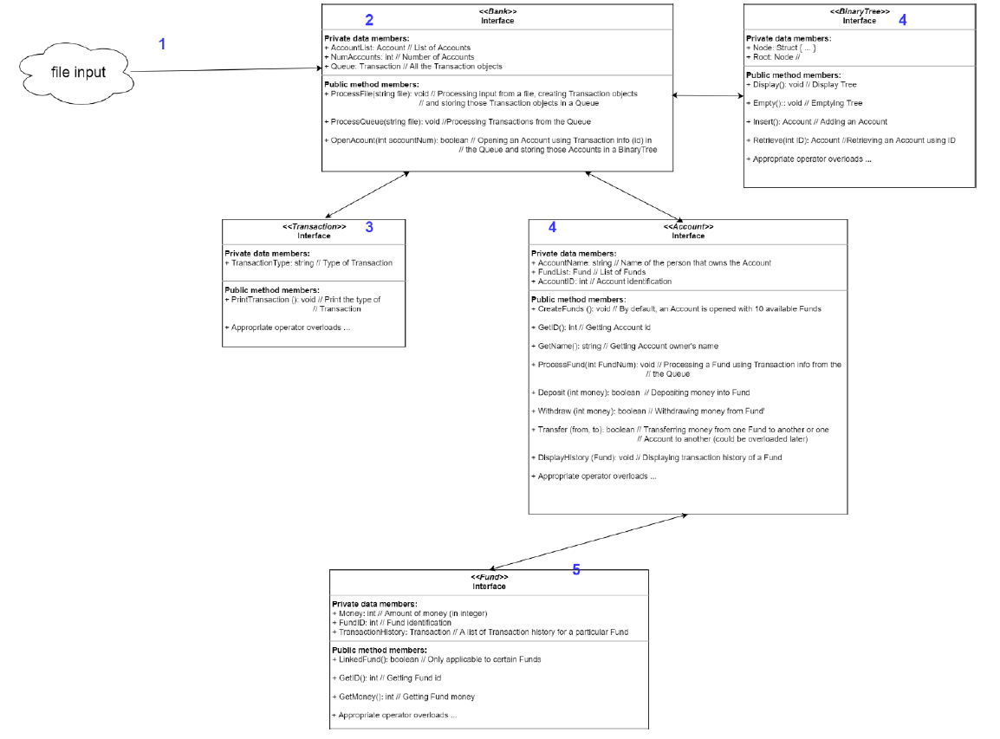

# the-new-banker

### Program Description

This program represents a banking application which processes transactions. This banking
application consists of three phases:
1) The program will read in a string of transactions from a file into an in-memory queue.
These transactions can open accounts, withdraw funds, deposit funds, transfer funds, or ask for
the transactional history to be printed.
2) The program will next read from the queue and process the transactions in order.
3) When the queue has been depleted the program will print out all open accounts and
balances in those accounts.

### Input 
a file (BankTransIn.txt) will be passed in by an argument to the program. The file will
contain a list of transactions that need to be executed. Transactions of the format described
below (see section on transactions) will be contained in this file. There will be one transaction
per line.

Client Accounts and Funds:
Each client account contains assets held in up to ten funds. A client account is
represented by a first and last name (two strings) and a unique 4 digit identifier. A fifth digit can
be added to the digit id to represent the individual fund within the account as enumerated
below:

0: Money Market 5: Capital Value Fund
1: Prime Money Market 6: Growth Equity Fund
2: Long-Term Bond 7: Growth Index Fund
3: Short-Term Bond 8: Value Fund
4: 500 Index Fund 9: Value Stock Index

For instance, 23452 represents the Long-Term Bond fund for client account 2345. A
client account is opened as a transaction (see below).

Transactions:
There are five types of transactions and each are identified by a character beginning the line.
O: Open a client account with the appropriate funds
D: Deposit assets into a fund
W: Withdraw assets from a fund
T: Transfer assets between funds (can be funds owned by a single client or
transfers between clients)
H: Display the history of all transactions for a client account or for a single fund.
Include errors in the output where appropriate.

### Output
D 12341 100 -> Deposit $100 into the prime money market account of client ID 1234
W 12340 500 -> Withdraw $500 from the money market of client ID 1234.
T 12340 1000 12341 -> Transfer $1000 from client 1234's money market to the prime money market.
T 12340 1000 56780 -> Transfer $1000 from 1234's money market to 5678's money market.
H 1234 -> Display the history of all transactions of all accounts for client 1234.
H 12344 -> Display the history for all transactions on the 500 Index Fund for client 1234
O Bowden Charles 6537 -> Open an account for client Charles Bowden. Use account id 6537.

### Class Diagram Design

